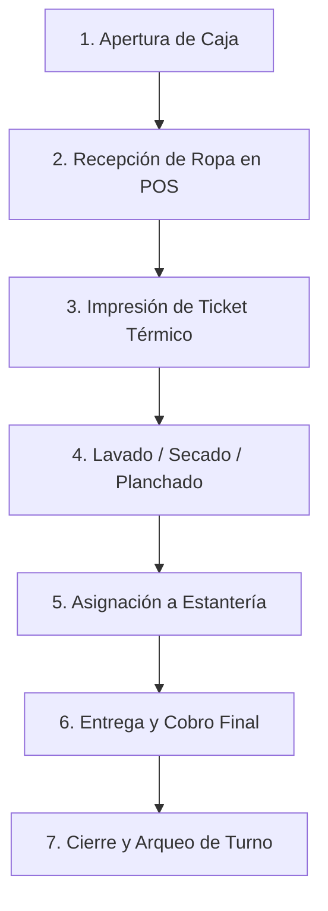

# Bienvenido a Klynn Cloud 🧺

**Klynn** es la plataforma SaaS integral en la nube diseñada específicamente para optimizar, ordenar y escalar lavanderías, tintorerías y sastrerías en República Dominicana y Latinoamérica.

Desde la recepción ágil de prendas en el mostrador hasta la contabilidad de caja, control de estantería, gestión de nómina por destajo y facturación electrónica fiscal con la DGII, Klynn reúne todas las áreas de tu negocio en una sola herramienta.

---

## 🧭 ¿Cómo está organizada esta documentación?

Navega a través de las secciones clave del sistema:

<CardGroup cols={2}>
  <Card title="Primeros Pasos" icon="rocket" href="/primeros-pasos/registro-invitacion">
    Aprende a activar tu cuenta con código de invitación y configurar tu sucursal.
  </Card>
  <Card title="Caja y Turnos" icon="cash-register" href="/caja-y-turnos/apertura-caja">
    Apertura de caja, registro de entradas/salidas y arqueo ciego al cierre.
  </Card>
  <Card title="Punto de Venta y Órdenes" icon="cart-shopping" href="/ordenes-y-pos/crear-orden">
    Recepción de ropa al peso, por piezas, cobro con tickets térmicos y seguimiento.
  </Card>
  <Card title="Estantería y Entregas" icon="boxes-stacked" href="/estanteria/organizacion-fisica">
    Localización rápida de prendas por zonas y casilleros sin demoras para el cliente.
  </Card>
  <Card title="Crédito (CXC y CXP)" icon="chart-line" href="/credito-y-finanzas/cxc-cuentas-por-cobrar">
    Control de deudas de clientes corporativos y pago a suplidores de insumos.
  </Card>
  <Card title="Nómina y Destajo" icon="users" href="/nomina/gestion-periodos">
    Cálculo de sueldos, comisiones por piezas lavadas/planchadas y horas extras.
  </Card>
  <Card title="Facturación Fiscal DGII" icon="file-invoice-dollar" href="/fiscal-dgii/comprobantes-ncf">
    Comprobantes fiscales tradicionales (B01, B02) y facturación electrónica e-CF.
  </Card>
  <Card title="Logística y Delivery" icon="truck-fast" href="/logistica-delivery/rutas-y-entregas">
    Coordinación de recogidas a domicilio, repartidores y confirmación de cobro.
  </Card>
</CardGroup>

---

## ⚡ Flujo Diario de Operaciones en Klynn

> 💡 **Nota Importante:** Klynn funciona 100% en la nube. Puedes acceder desde computadoras en el mostrador, tablets iPad o Android, y teléfonos móviles sin necesidad de instalar servidores locales.
