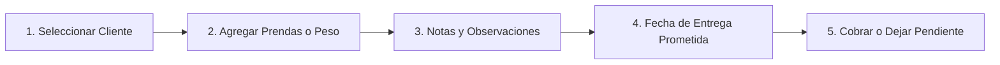

# Cómo Crear una Orden en el Mostrador (POS) 🧺

El módulo de Punto de Venta de Klynn está diseñado para que un cajero pueda registrar una orden completa en menos de 30 segundos.

---

## ⚡ Flujo de Recepción Paso a Paso

### Paso 1: Identificar al Cliente
* En la parte superior izquierda, busca al cliente escribiendo sus primeros dígitos del teléfono o nombre.
* Si es nuevo, pulsa en **"Nuevo Cliente"** para registrarlo al instante.

### Paso 2: Agregar los Servicios y Prendas
Klynn permite combinar servicios en la misma orden:
1. **Ropa al Peso (Lavado Diario):**
   * Pesa la ropa en tu balanza física y escribe el número de libras (ejemplo: `14.5` lbs).
   * Klynn multiplicará automáticamente por el precio configurado.
2. **Prendas Individuales y Tintorería:**
   * Haz clic en los botones rápidos de categorías (Camisas, Pantalones, Vestidos, Edredones).
   * Pulsa repetidamente para incrementar la cantidad (+1, +2, etc.).

### Paso 3: Observaciones de Prendas (¡Muy Importante!)
Para evitar reclamos posteriores:
* Selecciona la prenda y añade una **Observación de Estado**:
  * *"Mancha de grasa previa en cuello"*.
  * *"Botón faltante en manga izquierda"*.
  * *"Desgaste / rasgadura en ruedo"*.
* Esta observación se imprimirá claramente en el ticket del cliente.

### Paso 4: Fecha y Hora Prometida de Entrega
* El sistema sugiere por defecto el tiempo estándar (ejemplo: 24 o 48 horas).
* Si el cliente solicitó servicio express o tiene una urgencia especial, puedes ajustar el día y la hora exacta en el selector.
