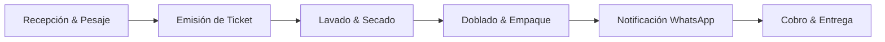

Bienvenido a la guía de inicio rápido de **Klynn**. En esta sección configurarás los datos básicos de tu sucursal, tus primeros servicios y realizarás tu primera orden de prueba.

<CardGroup cols={2}>
  <Card title="Conceptos Clave" icon="book-open" href="/primeros-pasos/conceptos-clave">
    Conoce la terminología básica del sistema: órdenes, prendas, pesaje y estados.
  </Card>
  <Card title="Crear Primera Orden" icon="cart-plus" href="/operaciones/crear-orden">
    Aprende a registrar un pedido en el mostrador rápidamente.
  </Card>
</CardGroup>

## Pasos para poner en marcha tu negocio

<Steps>
  <Step title="Configura los datos de tu sucursal">
    Accede a **Configuración > Datos del Negocio** e ingresa:
    * Nombre comercial y RNC/Identificación fiscal.
    * Dirección física y números de contacto (teléfono y WhatsApp).
    * Mensaje predeterminado para los tickets impresos y digitales.
  </Step>

  <Step title="Define tu catálogo de servicios básicos">
    Por defecto, Klynn incluye plantillas comunes. Ve a **Servicios** y ajusta los precios:
    * **Lavado por Kilo / Libra**: Para ropa de diario y cargas estándar.
    * **Prendas Individuales**: Edredones, trajes, vestidos y piezas especiales.
    * **Servicios Adicionales**: Planchado, desmanchado profundo o perfumado especial.

    <Tip>
      Puedes definir tarifas diferenciadas si ofreces servicio regular o servicio express (entrega en 2 a 4 horas).
    </Tip>
  </Step>

  <Step title="Registra a tus operadores y cajeros">
    Crea usuarios individuales para tu personal con roles específicos (**Administrador**, **Cajero / Recepción** u **Operador de Planta**). Esto garantiza un control estricto de accesos y trazabilidad por orden.
  </Step>

  <Step title="Conecta tu impresora de tickets">
    Klynn es compatible con impresoras térmicas ESC/POS (USB, Bluetooth y de red). En **Configuración > Tickets e Impresoras** podrás imprimir un ticket de prueba.
  </Step>
</Steps>

## Flujo general de trabajo

<Note>
  Si necesitas ayuda durante el proceso, puedes contactar al equipo de soporte directamente desde el botón de ayuda en la esquina superior derecha del panel de Klynn.
</Note>
